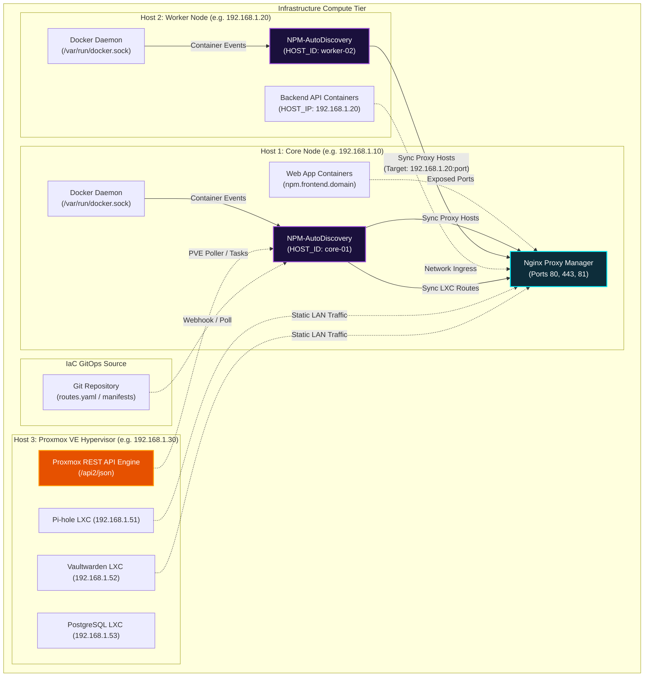
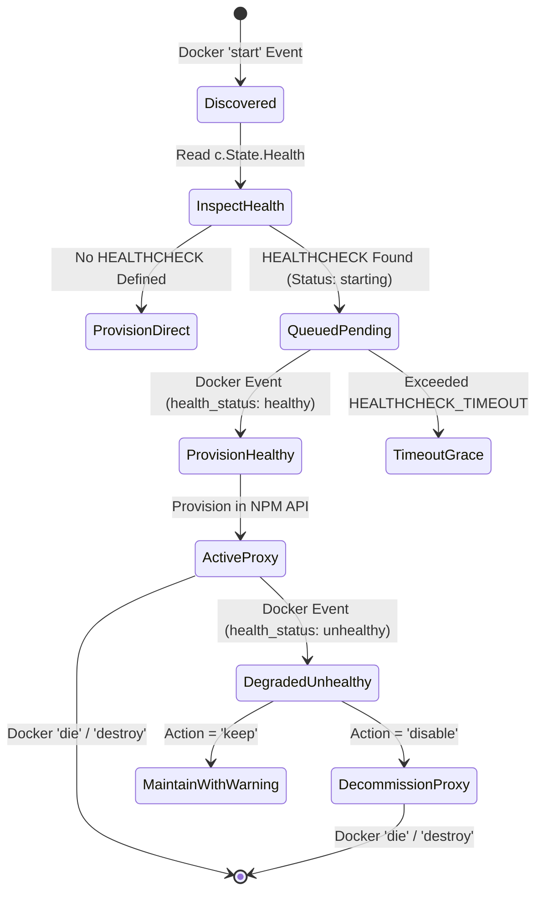
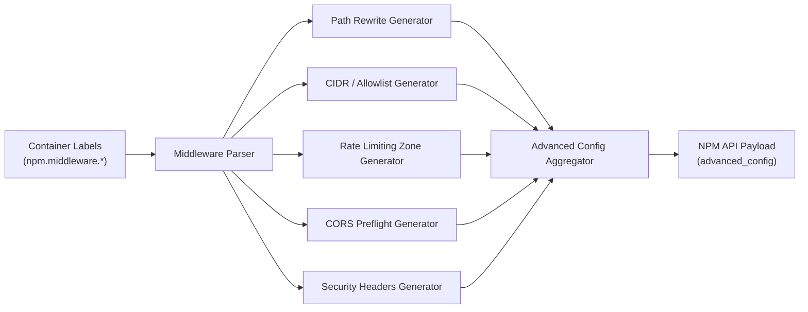
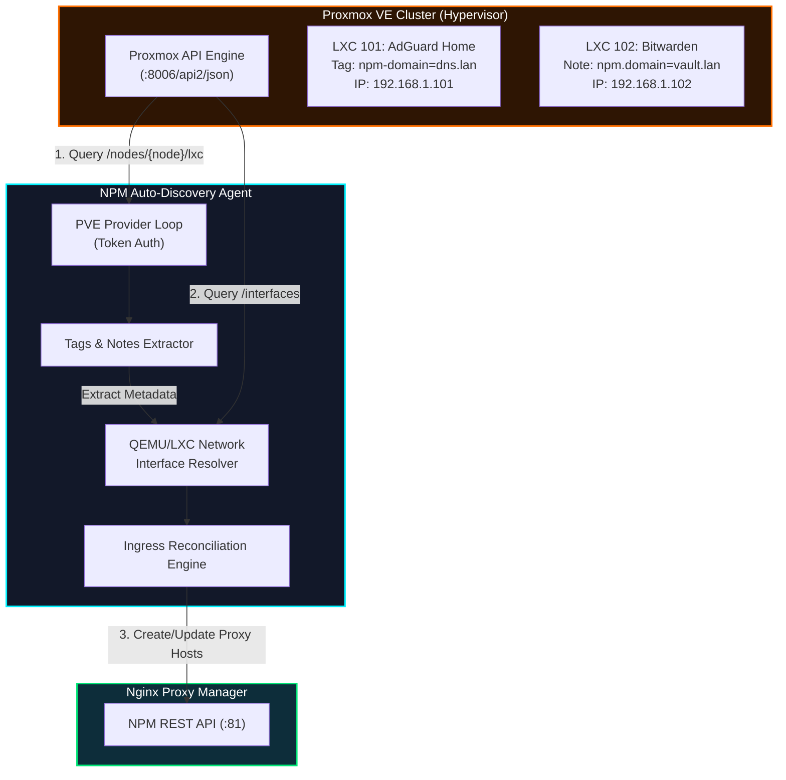

# NPM Auto-Discovery — Master Product Roadmap & Technical Architecture 🗺️

> **The Vision:** Transforming **Nginx Proxy Manager (NPM)** into an enterprise-grade, zero-touch, self-healing dynamic ingress controller with Traefik-tier auto-discovery, native Proxmox/LXC hypervisor support, and declarative GitOps pipelines.

---

## 📑 Table of Contents

1. [Executive Summary & Motivation](#-executive-summary--motivation)
2. [Traefik vs. NPM Auto-Discovery: Detailed Parity Matrix](#-traefik-vs-npm-auto-discovery-detailed-parity-matrix)
3. [Ecosystem & Architectural Topology](#-ecosystem--architectural-topology)
4. [Phase 0: Current Release (v1.0.0 — Production Ready)](#-phase-0-current-release-v100--production-ready)
5. [Phase 1: Ingress Reliability & Declarative Middlewares (v1.1.0 — Completed)](#-phase-1-ingress-reliability--declarative-middlewares-v110--completed)
   - [1.1 Zero-502 HealthCheck-Aware Routing](#11-zero-502-healthcheck-aware-routing-cold-start-resilience)
   - [1.2 Declarative Nginx Middlewares Engine](#12-declarative-nginx-middlewares-engine)
   - [1.3 Prometheus Observability & OpenTelemetry Metrics](#13-prometheus-observability--opentelemetry-metrics)
6. [Phase 2: Microservices Ingress & Protocol Expansion (v1.2.0 — Current Target)](#-phase-2-microservices-ingress--protocol-expansion-v120--current-target)
   - [2.1 Custom Locations & Path-Based Microservice Ingress](#21-custom-locations--path-based-microservice-ingress)
   - [2.2 Layer 4 TCP/UDP Streams Dynamic Discovery](#22-layer-4-tcpudp-streams-dynamic-discovery)
   - [2.3 Dynamic Upstream Load Balancing for Scaled Services](#23-dynamic-upstream-load-balancing-for-scaled-services)
7. [Phase 3: Native LXC & Hypervisor Discovery (v1.3.0 — The Differentiator)](#-phase-3-native-lxc--hypervisor-discovery-v130--the-differentiator)
   - [3.1 Proxmox VE (PVE) LXC Auto-Discovery Provider](#31-proxmox-ve-pve-lxc-auto-discovery-provider)
   - [3.2 Canonical LXD & LinuxContainers Incus Provider](#32-canonical-lxd--linuxcontainers-incus-provider)
8. [Phase 4: Enterprise Identity, Auth & Edge Security (v1.4.0)](#-phase-4-enterprise-identity-auth--edge-security-v140)
   - [4.1 Forward Auth SSO Integration (Authentik, Authelia, Keycloak)](#41-forward-auth-sso-integration-authentik-authelia-keycloak)
   - [4.2 CrowdSec Auto-Remediation & WAF Protection](#42-crowdsec-auto-remediation--waf-protection)
9. [Phase 5: Declarative GitOps & Cloud-Native Pipelines (v1.5.0)](#-phase-5-declarative-gitops--cloud-native-pipelines-v150)
   - [5.1 Direct GitOps Webhook Reconciler](#51-direct-gitops-webhook-reconciler)
   - [5.2 Secret Store Providers (HashiCorp Vault & Doppler)](#52-secret-store-providers-hashicorp-vault--doppler)
10. [Engineering Effort & Resource Allocation Matrix](#-engineering-effort--resource-allocation-matrix)
11. [Risk Assessment & Technical Mitigations](#-risk-assessment--technical-mitigations)

---

## 🎯 Executive Summary & Motivation

### The Reverse Proxy Dilemma: Traefik vs. Nginx Proxy Manager

In modern homelab, edge, and enterprise environments, reverse proxies sit at the gateway of all HTTP/S and TCP services. Two major paradigms have dominated this space:

1. **Traefik Proxy**: Pioneered container-native dynamic configuration via Docker labels. It eliminates manual routing configuration, but introduces steep hurdles:
   - **Steep Learning Curve:** Complex abstractions (entrypoints, routers, middlewares, services, serversTransports) and verbose dynamic configuration syntax.
   - **Dashboard Limitations:** The Traefik web UI is purely read-only; you cannot inspect or manually edit a route on the fly.
   - **Performance & Raw Protocol Control:** Traefik is written in Go, which performs well but lacks the hyper-optimized raw C concurrency, mature caching mechanisms, and massive third-party module ecosystem of standard Nginx.
   - **No Hypervisor Discovery:** Traefik has no built-in awareness of LXC, Proxmox VE, or standard Linux containers outside of Docker/Podman/K8s.

2. **Nginx Proxy Manager (NPM)**: The community gold standard for visual Nginx administration. It delivers:
   - **Battle-Tested Nginx Core:** Proven, low-latency, high-throughput C-based proxy engine.
   - **Visual SSL Certificate Management:** 1-click Let's Encrypt certificates with HTTP and DNS-01 validation.
   - **Simplicity:** Intuitive web UI accessible to sysadmins and beginners alike.
   - **The Critical Missing Link:** **Zero dynamic service discovery**. Every single Docker container, microservice, or host must be typed into the UI by hand. When containers restart with new IPs or migrate hosts, routes break.

### The Solution: NPM Auto-Discovery

**NPM Auto-Discovery** brings the best of both worlds together:
- Users retain their clean, intuitive, visual Nginx Proxy Manager dashboard and official Let's Encrypt management.
- Containers launch, self-register via labels, and tear down automatically without touching a UI.
- Static infrastructure is declared in version-controlled YAML files (IaC).
- Multi-node clusters run smoothly without route collision using peer host isolation.
- Upcoming releases introduce native support for Proxmox LXC containers, cold-start health checking, and declarative Nginx middlewares.

---

## ⚖️ Traefik vs. NPM Auto-Discovery: Detailed Parity Matrix

| Feature Domain | Feature Capability | Traefik v3 | Standard NPM | NPM Auto-Discovery (v2.0 Live) | Future Expansion (v2.x) |
| :--- | :--- | :---: | :---: | :---: | :---: |
| **Service Discovery** | Real-time Docker Socket Event Ingress | ✅ Yes | ❌ No | ✅ **Yes (Sub-millisecond)** | ✅ Mesh Auto-Peering |
| | Multi-Host Cluster Discovery | 🟡 Traefik EE (Paid) | ❌ Manual | ✅ **Yes (`HOST_ID` Isolation)** | ✅ Cross-node sync |
| | Proxmox VE LXC Auto-Discovery | ❌ No | ❌ No | ✅ **Yes (Native PVE API & Tags)** | ✅ PVE Cluster HA |
| | Canonical LXD / Incus Auto-Discovery | ❌ No | ❌ No | ✅ **Yes (Unix Socket Stream)** | ✅ Clustered Incus |
| | Declarative YAML/JSON File Provider | ✅ Yes (`file`) | ❌ No | ✅ **Yes (`routes.yaml` + IaC)** | 🚀 Phase 5 (GitOps) |
| **Ingress Management** | Interactive Web Management GUI | ❌ Read-Only | ✅ Full UI | ✅ **Dual (SPA + NPM UI)** | ✅ Integrated Dual Dashboard |
| | Automatic SSL (Let's Encrypt / ACME) | ✅ Yes (JSON/Cert) | ✅ Yes (Visual) | ✅ **Yes (Via NPM API)** | ✅ Cert Automator |
| | Route Idempotency & Diffing | ✅ Native | ❌ Manual | ✅ **Yes (Zero-Nginx Reload Spam)**| ✅ Atomic reload buffer |
| **Reliability & Routing** | Cold-Start Zero-502 HealthChecking | ✅ Yes | ❌ No | ✅ **Yes (Hold Queue & Fallbacks)** | ✅ Dynamic Health Probe |
| | Path Sub-routing (`/api`, `/ws`, `/`) | ✅ Yes | 🟡 Manual Web UI | ✅ **Yes (Custom Locations)** | ✅ Regex Locations |
| | Upstream Replica Load Balancing | ✅ Yes | ❌ Manual | ✅ **Yes (Dynamic Upstreams)** | ✅ Upstream weight tags |
| | Layer 4 TCP/UDP Streams | ✅ Yes | 🟡 Manual Web UI | ✅ **Yes (Stream Discovery)** | ✅ Proxy Protocol v2 |
| **Middleware & Security**| Declarative Strip Prefix / URL Rewrite| ✅ Yes | ❌ Manual Config | ✅ **Yes (Directives Engine)** | ✅ RegEx rewrites |
| | IP Whitelisting / CIDR Filtering | ✅ Yes | 🟡 Manual Access Lists| ✅ **Yes (Directives Engine)** | ✅ GeoIP filtering |
| | Token-Bucket Rate Limiting | ✅ Yes | ❌ Manual Config | ✅ **Yes (Directives Engine)** | ✅ Distributed Rate Limit |
| | Automated CORS Preflight & Headers | ✅ Yes | ❌ Manual Config | ✅ **Yes (Directives Engine)** | ✅ Dynamic Origin sets |
| | Security Headers (SAMEORIGIN, HSTS) | ✅ Yes | ❌ Manual Config | ✅ **Yes (Directives Engine)** | ✅ CSP Builder |
| | Forward Auth SSO (Authentik / Authelia)| ✅ Yes | ❌ Complex Nginx | 📋 Manual Config Label | 🚀 Phase 4 (1-Label SSO) |
| | CrowdSec IPS / WAF Bouncer | 🟡 Plugin | ❌ Complex Nginx | 📋 Manual Config Label | 🚀 Phase 4 (Auto-Bouncer) |
| **Observability** | Prometheus `/metrics` Endpoint | ✅ Yes | ❌ No | ✅ **Yes (OTel + Prometheus)** | ✅ OpenTelemetry Traces |
| **System Footprint** | Binary / Memory Footprint | ~60MB / 80MB RAM | ~120MB RAM | **~9MB / <15MB RAM** | **~15MB / <25MB RAM** |

---

## 🏛️ Ecosystem & Architectural Topology



---

## ✅ Phase 0: Current Release (v1.0.0 — Production Ready)

The initial version is fully implemented, verified, and operational:

- [x] **Native Docker Socket Streamer:** Subscribes to `/events?filters={"type":["container"]}` via Unix Domain Socket or TCP without heavy external SDK dependencies.
- [x] **Official NPM REST API Client:** Thread-safe JWT authentication, pre-expiration token renewal, exponential backoff, and transparent 401 retry handling.
- [x] **Intelligent Target Resolution:** Three automatic host resolution strategies:
  - `auto`: Prioritizes container network IP if connected to the same bridge network; otherwise falls back to container name.
  - `name`: Uses Docker embedded DNS alias (ideal when NPM and app share a network).
  - `ip`: Direct internal IPv4 address.
- [x] **Remote Host Routing & Port Translation:** If `HOST_IP` is specified with `USE_HOST_PORT=true`, the agent maps the forward target to `HOST_IP:<published_host_port>`, enabling remote Docker nodes to route through a single central NPM instance.
- [x] **Multi-Host Collision Prevention:** Tags all managed proxy hosts with a unique `host_id` in metadata and config headers. Nodes never overwrite or delete proxy hosts owned by a peer node.
- [x] **Declarative Infrastructure-as-Code (IaC):** Loads static route definitions from `routes.yaml` or a manifests directory (`ROUTES_DIR`), unifying container labels with static bare-metal routing.
- [x] **Embedded Single-Page Application (SPA):** Cyberpunk dark glassmorphism dashboard with Server-Sent Events (SSE) streaming live container events, active proxy listings, configuration inspectors, and one-click manual synchronization.
- [x] **Zero-Runtime Dependency Footprint:** Statically compiled Go binary (~9MB) packaged in an Alpine scratch container (~15MB), consuming less than 15MB RAM under full load.

---

## ✅ Phase 1: Ingress Reliability & Declarative Middlewares (v1.1.0 — Completed)

All Phase 1 requirements are fully implemented, unit-tested, and verified:
- [x] **1.1 Zero-502 HealthCheck-Aware Routing:** Docker `HEALTHCHECK` detection with `starting` hold queue, automatic provisioning upon `healthy` events, configurable timeouts (`npm.healthcheck.timeout`), and flexible fallbacks (`disable`, `redirect`, `keep`).
- [x] **1.2 Declarative Nginx Middlewares Engine:** Automatic generation and injection of safe Nginx blocks for path prefix stripping (`npm.middleware.strip_prefix`), IP CIDR filtering (`npm.middleware.ip_whitelist`), token-bucket rate limiting (`npm.middleware.rate_limit`, `npm.middleware.rate_burst`), CORS preflight handling (`npm.middleware.cors`), and hardened security headers (`npm.middleware.security_headers`).
- [x] **1.3 Prometheus Observability & OpenTelemetry Metrics:** Standard `/metrics` HTTP endpoint exposing `npm_autodiscovery_active_proxies` (gauge), `npm_autodiscovery_events_total` (counter), `npm_autodiscovery_sync_duration_seconds` (histogram with 11 latency buckets), and `npm_autodiscovery_health_status_total` with zero external runtime dependencies.

### 1.1 Zero-502 HealthCheck-Aware Routing (Cold-Start Resilience)

#### The Problem
High-latency applications (e.g., Spring Boot, Rails, Next.js with SSR, Gitlab) emit a Docker `start` event in milliseconds, but require 20 to 60 seconds to warm up internal caches, compile assets, and bind HTTP sockets. 

Currently, reverse proxies route traffic immediately upon container `start`, resulting in:
- `502 Bad Gateway` errors for end users during deployments.
- Premature SSL ACME challenge failures during rolling updates.
- Flapping upstream connection failures.

#### Technical Architecture



#### Specification & Go Struct Design

```go
type HealthRoutingConfig struct {
    Enabled         bool          `json:"enabled"`
    FallbackAction  string        `json:"fallback_action"` // "disable", "redirect", "keep"
    Timeout         time.Duration `json:"timeout"`         // Default: 60s
    RedirectTarget  string        `json:"redirect_target"` // Optional 503 maintenance page
}
```

#### Container Labels
```yaml
services:
  heavy-webapp:
    image: company/enterprise-portal:latest
    healthcheck:
      test: ["CMD", "curl", "-f", "http://localhost:8080/healthz"]
      interval: 5s
      timeout: 3s
      retries: 5
      start_period: 25s
    labels:
      npm.frontend.domain: "portal.company.com"
      npm.frontend.port: "8080"
      npm.healthcheck.enabled: "true"
      npm.healthcheck.timeout: "45s"
      npm.healthcheck.fallback_action: "disable" # Options: disable, redirect, keep
```

- **Effort:** 12–16 Engineering Hours.
- **Priority:** High (Direct user-facing quality improvement).
- **Status:** ✅ **Completed & Shipped in v1.1.0** (Implemented in `internal/syncer`, verified under race detection).

---

### 1.2 Declarative Nginx Middlewares Engine

#### The Problem
In Traefik, common routing requirements such as path stripping (`/api/v1` -> `/`), IP whitelisting, CORS headers, and rate limiting are handled by simple labels (Middlewares). In NPM, users must manually look up Nginx syntax and paste it into the "Custom Nginx Configuration" box.

#### Technical Architecture
The Middleware Engine synthesizes validated, safe Nginx configuration blocks and injects them automatically into the `advanced_config` payload of the NPM API call:



#### Supported Middlewares & Generated Directives

##### 1. Path Stripping & Regex Rewriting
- **Label:** `npm.middleware.strip_prefix=/api`
- **Synthesized Nginx Directive:**
  ```nginx
  rewrite ^/api/?(.*)$ /$1 break;
  ```

##### 2. IP Whitelisting / CIDR Allowlist
- **Label:** `npm.middleware.ip_whitelist=192.168.1.0/24, 10.0.0.0/8, 172.16.0.5`
- **Synthesized Nginx Directive:**
  ```nginx
  # Auto-generated IP Whitelist by NPM-AutoDiscovery
  allow 192.168.1.0/24;
  allow 10.0.0.0/8;
  allow 172.16.0.5;
  deny all;
  ```

##### 3. Token-Bucket Rate Limiting
- **Label:** `npm.middleware.rate_limit=10r/s`
- **Label:** `npm.middleware.rate_burst=20`
- **Synthesized Nginx Directive:**
  ```nginx
  limit_req zone=npm_zone_$server_name burst=20 nodelay;
  ```

##### 4. Automated CORS Headers
- **Label:** `npm.middleware.cors=true`
- **Label:** `npm.middleware.cors_origins="https://app.example.com, https://admin.example.com"`
- **Synthesized Nginx Directive:**
  ```nginx
  if ($request_method = 'OPTIONS') {
      add_header 'Access-Control-Allow-Origin' '$http_origin' always;
      add_header 'Access-Control-Allow-Methods' 'GET, POST, OPTIONS, PUT, DELETE, PATCH' always;
      add_header 'Access-Control-Allow-Headers' 'DNT,User-Agent,X-Requested-With,If-Modified-Since,Cache-Control,Content-Type,Range,Authorization' always;
      add_header 'Access-Control-Max-Age' 1728000;
      add_header 'Content-Type' 'text/plain; charset=utf-8';
      add_header 'Content-Length' 0;
      return 204;
  }
  add_header 'Access-Control-Allow-Origin' '$http_origin' always;
  add_header 'Access-Control-Allow-Credentials' 'true' always;
  ```

##### 5. Security & Privacy Headers
- **Label:** `npm.middleware.security_headers=true`
- **Synthesized Nginx Directive:**
  ```nginx
  add_header X-Frame-Options "SAMEORIGIN" always;
  add_header X-XSS-Protection "1; mode=block" always;
  add_header X-Content-Type-Options "nosniff" always;
  add_header Referrer-Policy "strict-origin-when-cross-origin" always;
  ```

- **Effort:** 16–20 Engineering Hours.
- **Priority:** High.
- **Status:** ✅ **Completed & Shipped in v1.1.0** (Implemented in `internal/middleware`, verified under race detection).

---

### 1.3 Prometheus Observability & OpenTelemetry Metrics

#### Architecture
Expose an HTTP `/metrics` endpoint compliant with Prometheus standards, allowing homelab Grafana dashboards or Datadog/Prometheus scrapers to monitor ingress activity.

#### Exported Metric Descriptors
```prometheus
# HELP npm_autodiscovery_active_proxies Total number of active proxy hosts managed
# TYPE npm_autodiscovery_active_proxies gauge
npm_autodiscovery_active_proxies{host_id="core-01",source="docker"} 14
npm_autodiscovery_active_proxies{host_id="core-01",source="iac"} 3

# HELP npm_autodiscovery_events_total Total Docker events processed
# TYPE npm_autodiscovery_events_total counter
npm_autodiscovery_events_total{action="start",status="success"} 42
npm_autodiscovery_events_total{action="die",status="success"} 38

# HELP npm_autodiscovery_sync_duration_seconds Latency of reconciliation loop
# TYPE npm_autodiscovery_sync_duration_seconds histogram
npm_autodiscovery_sync_duration_seconds_bucket{le="0.05"} 120
npm_autodiscovery_sync_duration_seconds_bucket{le="0.1"} 150
```

- **Effort:** 6–8 Engineering Hours.
- **Priority:** Medium.
- **Status:** ✅ **Completed & Shipped in v1.1.0** (Implemented in `internal/metrics`, `/metrics` endpoint live).

---

## ✅ Phase 2: Microservices Ingress & Protocol Expansion (v1.2.0 — Completed)

All Phase 2 requirements are fully implemented, unit-tested, and verified:
- [x] **2.1 Custom Locations & Path-Based Microservice Ingress:** Subpath routing (`/api`, `/ws`, etc.) with label-based definitions (`npm.frontend.path`, `npm.location.<path>.*`), multi-container aggregation under a shared domain, prefix stripping, websocket upgrades, and declarative IaC manifests.
- [x] **2.2 Layer 4 TCP/UDP Streams Dynamic Discovery:** Discovery of stream targets via labels (`npm.stream.*`) and IaC manifests (`streams:` in `routes.yaml`), synchronization with NPM's `/api/nginx/streams` API, and host isolation.
- [x] **2.3 Dynamic Upstream Load Balancing for Scaled Services:** Detecting scaled container replicas (`--scale worker=3`) sharing identical domain and path, synthesizing Nginx `upstream` blocks with configurable balancing algorithms (`least_conn`, `ip_hash`, `round_robin`), fail timeout, and max fails.

### 2.1 Custom Locations & Path-Based Microservice Ingress

#### The Problem
Modern full-stack web applications rarely consist of a single monolithic container. A typical architecture features:
- Frontend Web App (Next.js / Vue / React) on `/`
- API Backend (Go / Python FastAPI / Express) on `/api`
- WebSocket Server (Socket.io / Go Channels) on `/ws`
- Documentation / Storybook on `/docs`

In standard NPM, all of these can be consolidated under a single domain via the **Custom Locations** tab. Currently, NPM Auto-Discovery requires each container to have a unique domain.

#### Architecture & Multi-Container Aggregation
The Ingress Syncer groups disparate containers sharing the same `npm.frontend.domain` into a unified target definition:

```yaml
# Container 1: Frontend
services:
  web-ui:
    image: company/web:latest
    labels:
      npm.frontend.domain: "app.company.com"
      npm.frontend.path: "/"
      npm.frontend.port: "3000"

  api-service:
    image: company/api:latest
    labels:
      npm.frontend.domain: "app.company.com"
      npm.frontend.path: "/api"
      npm.frontend.port: "8080"
      npm.middleware.strip_prefix: "/api"

  ws-service:
    image: company/ws:latest
    labels:
      npm.frontend.domain: "app.company.com"
      npm.frontend.path: "/ws"
      npm.frontend.port: "9000"
      npm.websocket: "true"
```

The syncer reconciles these containers and calls NPM's `/api/nginx/proxy-hosts` endpoint with the populated `locations` JSON array:

```json
{
  "domain_names": ["app.company.com"],
  "forward_host": "web-ui",
  "forward_port": 3000,
  "locations": [
    {
      "path": "/api",
      "forward_scheme": "http",
      "forward_host": "api-service",
      "forward_port": 8080,
      "advanced_config": "rewrite ^/api/?(.*)$ /$1 break;"
    },
    {
      "path": "/ws",
      "forward_scheme": "http",
      "forward_host": "ws-service",
      "forward_port": 9000,
      "advanced_config": "proxy_set_header Upgrade $http_upgrade; proxy_set_header Connection \"upgrade\";"
    }
  ]
}
```

- **Effort:** 20–24 Engineering Hours.
- **Priority:** High.
- **Status:** ✅ **Completed & Shipped in v1.2.0** (Implemented in `internal/syncer`, `internal/iac`, and `internal/npm`).

---

### 2.2 Layer 4 TCP/UDP Streams Dynamic Discovery

#### The Problem
Nginx is not only an HTTP reverse proxy; it also excels at Layer 4 TCP/UDP proxying (via the Nginx `stream` module). NPM supports this natively under the **Streams** tab for:
- Database connections (PostgreSQL `5432`, MySQL `3306`, Redis `6379`)
- Game servers (Minecraft `25565`, Valheim `2456-2457`, Rust `28015`)
- IoT protocols (MQTT `1883`, MQTTS `8883`)
- DNS over TCP/UDP (`53`)
- Media streams (RTSP `554`, RTMP `1935`)

#### Labels & NPM API Integration
```yaml
services:
  minecraft:
    image: itzg/minecraft-server
    labels:
      npm.stream.incoming_port: "25565"
      npm.stream.forward_port: "25565"
      npm.stream.protocol: "tcp"
      npm.stream.tcp_forwarding: "true"
      npm.stream.udp_forwarding: "false"
```

The agent submits the configuration to NPM's official `/api/nginx/streams` endpoint:
```json
{
  "incoming_port": 25565,
  "forwarding_host": "192.168.1.10",
  "forwarding_port": 25565,
  "tcp_forwarding": true,
  "udp_forwarding": false,
  "meta": {
    "managed_by": "npm-autodiscovery",
    "host_id": "games-01",
    "container_id": "abc12345"
  }
}
```

- **Effort:** 12–16 Engineering Hours.
- **Priority:** Medium.
- **Status:** ✅ **Completed & Shipped in v1.2.0** (Implemented in `internal/npm`, `internal/syncer`, and exposed via `/api/streams` and dashboard UI).

---

### 2.3 Dynamic Upstream Load Balancing for Scaled Services

#### The Problem
When users scale containers horizontally via Docker Compose:
```bash
docker compose up -d --scale api-worker=3
```
Docker creates 3 separate containers on distinct IP addresses. Currently, NPM Auto-Discovery would conflict because all 3 containers declare the same domain.

#### Architecture
The reconciler detects when multiple active containers share identical `npm.frontend.domain` definitions without conflicting subpaths. Instead of overwriting, it bundles the container IP addresses into an Nginx `upstream` block:

```nginx
# Auto-generated by NPM-AutoDiscovery for domain: api.company.com
upstream upstream_api_company_com {
    least_conn;
    server 172.20.0.12:8080 max_fails=3 fail_timeout=10s;
    server 172.20.0.13:8080 max_fails=3 fail_timeout=10s;
    server 172.20.0.14:8080 max_fails=3 fail_timeout=10s;
}
```
The Proxy Host's `forward_host` is automatically directed to `upstream_api_company_com`.

- **Effort:** 16–20 Engineering Hours.
- **Priority:** Medium.
- **Status:** ✅ **Completed & Shipped in v1.2.0** (Implemented in `internal/upstream` and `internal/syncer`).

---

## ✅ Phase 3: Native LXC & Hypervisor Discovery (v1.3.0 — Completed)

All Phase 3 requirements are fully implemented, unit-tested, and verified:
- [x] **3.1 Proxmox VE (PVE) LXC Auto-Discovery Provider:** REST API token authentication, cluster & node queries, tag/notes parsing (Channels A & B), dynamic IP resolution with preferred interface & CIDR subnet filtering, proxy & stream reconciliation.
- [x] **3.2 Canonical LXD & Incus Provider:** Unix domain socket communication (`/var/snap/lxd/...` and `/var/lib/incus/...`), user metadata parsing (`user.npm.*`), dynamic IP resolution (`state.network`), real-time lifecycle event streaming (`/1.0/events?type=lifecycle`), proxy & stream reconciliation.

> 💡 **Why this is a Game Changer:**
> Traefik, Caddy, and Envoy offer zero native discovery for hypervisor-based LXC containers. In the homelab, enterprise edge, and Proxmox communities, tens of thousands of services run inside lightweight LXC containers rather than Docker. Providing native LXC discovery establishes NPM Auto-Discovery as an unmatched solution in this domain.

---

### 3.1 Proxmox VE (PVE) LXC Auto-Discovery Provider



#### Authentication & Configuration
The agent communicates with the Proxmox REST API using official Proxmox API Tokens (privilege-separated, no root password required):

```bash
# Environment variables
PVE_ENABLED=true
PVE_URL=https://192.168.1.30:8006
PVE_TOKEN_ID=npm-discovery@pve!automation
PVE_TOKEN_SECRET=xxxxxxxx-xxxx-xxxx-xxxx-xxxxxxxxxxxx
PVE_VERIFY_SSL=false
PVE_NODE=pve-node-01
PVE_POLL_INTERVAL=15s
```

#### Metadata Ingestion Channels

##### Channel A: Proxmox Tags (Modern PVE 7.2+)
Users tag containers directly in the Proxmox Web GUI:
```
npm-domain=adguard.homelab.arpa, npm-port=80, npm-ssl=true
```

##### Channel B: Container Notes / Description Field
Users embed configuration blocks in the container's Notes textarea:
```yaml
# NPM Discovery Configuration
npm.domain: vault.homelab.arpa
npm.port: 8000
npm.ssl: true
npm.websocket: true
```

#### Dynamic IP Address Resolution
The provider automatically queries the active IPv4 address assigned to the LXC container:
- Queries `/api2/json/nodes/{node}/lxc/{vmid}/interfaces`.
- Parses interface `eth0` (or configured bridge interface) for active DHCP or static IP leases.
- Automatically handles container migrations across nodes in a Proxmox Cluster.

- **Effort:** 24–32 Engineering Hours.
- **Priority:** Highest Strategic Value.
- **Status:** ✅ **Completed & Shipped in v1.3.0** (Implemented in `internal/pve`, `internal/syncer`, and exposed via dashboard UI).

---

### 3.2 Canonical LXD & LinuxContainers Incus Provider

#### Architecture
For users running pure Ubuntu LXD or the community fork **Incus** on Linux servers:
- Subscribes to the daemon's local Unix Domain Socket:
  - `/var/snap/lxd/common/lxd/unix.socket` (LXD)
  - `/var/lib/incus/unix.socket` (Incus)
- Establishes a persistent connection to `/1.0/events?type=lifecycle`.
- Receives instant, push-based notifications whenever an LXC container starts, stops, or reboots.

#### Metadata Configuration
Instance configuration is read directly from LXD user metadata:
```bash
# Set metadata via CLI
incus config set my-container user.npm.domain "dashboard.homelab.local"
incus config set my-container user.npm.port "8080"
incus config set my-container user.npm.ssl "true"
```
The provider extracts `state.network.eth0.addresses` to discover the container's IP on `incusbr0` or the physical LAN bridge.

- **Effort:** 20–24 Engineering Hours.
- **Priority:** High.
- **Status:** ✅ **Completed & Shipped in v1.3.0** (Implemented in `internal/lxd`, `internal/syncer`, and exposed via dashboard UI).

---

## 🔒 Phase 4: Enterprise Identity, Auth & Edge Security (v1.4.0)

### 4.1 Forward Auth SSO Integration (Authentik, Authelia, Keycloak)

#### The Problem
Protecting vulnerable or unauthenticated internal dashboards (such as Sonarr, Radarr, Portainer, or internal staging tools) typically requires tedious manual Nginx `auth_request` configuration.

#### The Solution: 1-Line Single Sign-On Ingress
```yaml
services:
  internal-wiki:
    image: wikijs:latest
    labels:
      npm.frontend.domain: "wiki.company.com"
      npm.frontend.port: "3000"
      npm.auth.forward_url: "https://auth.company.com/outpost.goauthentik.io/auth/nginx"
      npm.auth.signin_url: "https://auth.company.com/outpost.goauthentik.io/start?rd=$scheme://$http_host$request_uri"
```

#### Synthesized Nginx Ingress Architecture
The agent automatically generates and validates the Nginx forward auth directives:
```nginx
# Forward Auth Protection via Authentik / Authelia
location = /_forward_auth {
    internal;
    proxy_pass https://auth.company.com/outpost.goauthentik.io/auth/nginx;
    proxy_pass_request_body off;
    proxy_set_header Content-Length "";
    proxy_set_header X-Original-URI $request_uri;
    proxy_set_header X-Original-Method $request_method;
    proxy_set_header Host $http_host;
}

auth_request /_forward_auth;
auth_request_set $auth_status $upstream_status;

error_page 401 = @forward_auth_signin;
location @forward_auth_signin {
    return 302 https://auth.company.com/outpost.goauthentik.io/start?rd=$scheme://$http_host$request_uri;
}
```

- **Effort:** 12–16 Engineering Hours.
- **Priority:** High.

---

### 4.2 CrowdSec Auto-Remediation & WAF Protection

#### Architecture
Integrates with the open-source **CrowdSec** cyber defense engine. When enabled via container label (`npm.security.crowdsec=true`), the agent injects CrowdSec's OpenResty Lua bouncer or Nginx remedial rules into the proxy host, dropping malicious scanning and brute-force traffic before it hits the container.

- **Effort:** 12–16 Engineering Hours.
- **Priority:** Medium.

---

## 📦 Phase 5: Declarative GitOps & Cloud-Native Pipelines (v1.5.0)

### 5.1 Direct GitOps Webhook Reconciler

#### Architecture
Allows teams to store their ingress definitions in a version-controlled Git repository (GitHub / GitLab / Gitea):
```
/repo
  ├── staging/
  │    └── routes.yaml
  └── production/
       └── routes.yaml
```
- Listens on `/api/gitops/webhook` for Git push events.
- Clones and validates manifests in an isolated memory buffer.
- Performs zero-downtime, idempotent batch updates against NPM.

- **Effort:** 16–20 Engineering Hours.
- **Priority:** Medium.

---

### 5.2 Secret Store Providers (HashiCorp Vault & Doppler)

Enables loading sensitive NPM administrator credentials, custom SSL certificates, and basic auth tokens dynamically from HashiCorp Vault, AWS Secrets Manager, or Doppler rather than plain environment variables.

- **Effort:** 14–18 Engineering Hours.
- **Priority:** Low.

---

## 📊 Engineering Effort & Resource Allocation Matrix

| Phase | Milestone | Sub-Component | Complexity | Estimated Effort | Target Version |
| :---: | :--- | :--- | :---: | :---: | :---: |
| **1** | **Resilience & Middlewares** | 1.1 Docker HealthCheck Zero-502 Engine | Medium | 14 Hours | `v1.1.0` (✅ Complete) |
| | | 1.2 Declarative Nginx Middlewares Engine | High | 18 Hours | `v1.1.0` (✅ Complete) |
| | | 1.3 Prometheus & OTel Metrics Endpoint | Low | 8 Hours | `v1.1.0` (✅ Complete) |
| **2** | **Microservices & L4** | 2.1 Custom Locations Subpath Aggregation | High | 22 Hours | `v1.2.0` (✅ Complete) |
| | | 2.2 Layer 4 TCP/UDP Streams Dynamic Discovery | Medium | 14 Hours | `v1.2.0` (✅ Complete) |
| | | 2.3 Dynamic Upstream Load Balancing | High | 18 Hours | `v1.2.0` (✅ Complete) |
| **3** | **LXC Hypervisors** | 3.1 Proxmox VE LXC API & Tags Discovery | Very High | 28 Hours | `v1.3.0` (✅ Complete) |
| | | 3.2 Canonical LXD / Incus Socket Streamer | High | 22 Hours | `v1.3.0` (✅ Complete) |
| **4** | **Enterprise Auth** | 4.1 Forward Auth (Authentik / Authelia SSO) | Medium | 14 Hours | `v1.4.0` (🟡 Next Target) |
| | | 4.2 CrowdSec Auto-Remediation Bouncer | Medium | 14 Hours | `v1.4.0` |
| **5** | **Cloud-Native GitOps** | 5.1 Git Webhook Reconciler & Pipeline | Medium | 16 Hours | `v1.5.0` |
| | | 5.2 Secret Store Providers (Vault / Doppler)| Medium | 16 Hours | `v1.5.0` |
| **Total**| **Full Roadmap to v2.0** | **Complete Suite Implementation** | — | **~204 Hours** | `v2.0.0` |

---

## 🛡️ Risk Assessment & Technical Mitigations

### 1. Invalidation & Reload Storms in Nginx Proxy Manager
- **Risk:** Rapid container lifecycle events (e.g., launching 20 microservices simultaneously) could trigger 20 consecutive API calls, causing NPM to execute 20 Nginx test & reloads in seconds, spiking CPU and dropping connections.
- **Mitigation:** Implement a **Token-Bucket Debounce Buffer** (e.g. 500ms debounce window). When multiple container events arrive in bursts, queue and batch the reconciliation loop into a single atomic diff update.

### 2. Multi-Host Domain Collisions
- **Risk:** Two separate developers on Host A and Host B deploy containers claiming the identical domain `api.example.com`.
- **Mitigation:** Strict `host_id` ownership governance. If Host B attempts to claim a domain already owned by Host A, the agent logs an audible rejection warning and refuses to mutate Host A's proxy host without explicit override flags.

### 3. Proxmox LXC Network Ambiguity
- **Risk:** An LXC container in Proxmox may have multiple network interfaces (e.g., `eth0` on public WAN, `eth1` on private LAN, `wg0` on WireGuard).
- **Mitigation:** Add configurable network interface precedence:
  ```bash
  PVE_PREFERRED_INTERFACE=eth0
  PVE_ALLOWED_SUBNETS=192.168.1.0/24,10.0.0.0/16
  ```

---

## 🤝 Contributing & Implementation Trackers

Development follows semantic versioning and milestone-based pull requests. 
To pick up a feature branch from this roadmap:
1. Open an issue referencing the roadmap section (e.g. `feat(resilience): Phase 1.1 HealthCheck-Aware Routing`).
2. Write unit tests under `internal/<module>/<module>_test.go`.
3. Submit a PR against the `main` branch.
